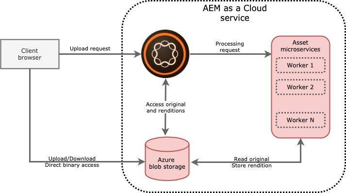
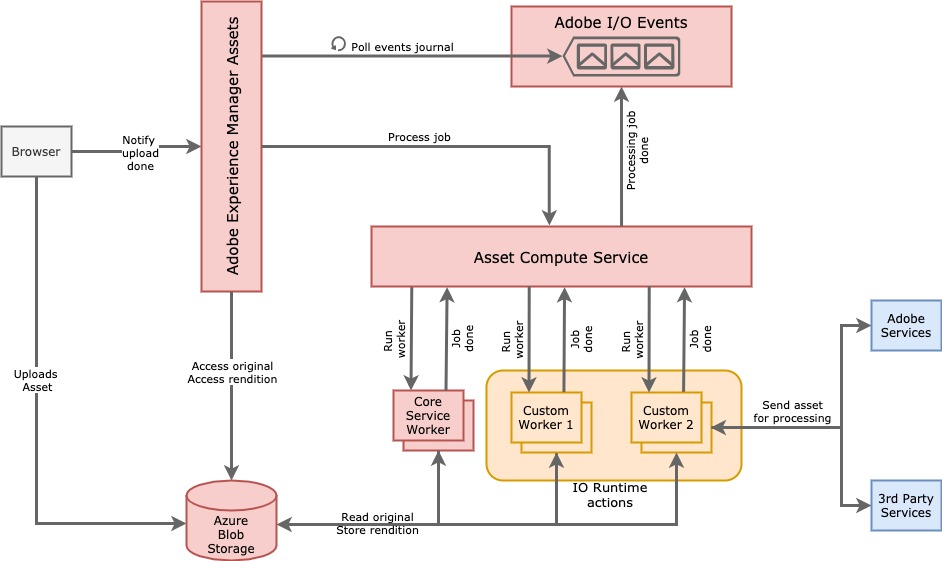

## How AEM as Cloud assets works

Asset binaries are no longer processed by the AEM instance. AEM only coordinates access to the Azure Blob storage where binaries are stored.

The right-hand red box on the diagram called **Asset microservices** are the services that are driven by Adobe Asset Compute which is built on top of Adobe IO Runtime. The aim of this service is to:

- Perform any kind of asset binary transformation, such as: resizing, cropping, intelligent cropping, colours
  manipulation or anything else you can imagine
- An image transformation is driven by the Adobe's internal services for image manipulation or by 3rd-party services in
  case of custom implementation.
- Store the result of the processing back to AEM as an asset rendition.

The high level architecture of the Asset Compute service is shown below.

A usuall flow of the data goes through the following steps:
1. Once an asset is uploaded, AEM sends a processing job to the Asset Compute service.
   - A job carries information such as the location of the source asset (on azure blob storage), desired rendition
     format (png, jpg, etc.), rendition sizes and/or quality, etc.
   - Optionally, the job can hold extra parameters defined on AEM if a custom worker is used.
2. Asset Compute service immediately returns the job ID back to the AEM and dispatches the job among available workers:
   - As you can see from the diagram, workers can be Adobe built-in workers or a custom worker, this is the thing we're
     about to build in this article.
3. When the worker is invoked, it usually downloads the source asset from the binary cloud storage and either forwards
   it to the third-party service for processing or does the image processing itself.
4. Once the worker's job is done, it uploads the result back to the binary cloud storage and notifies Asset Compute
   service it's done.
5. Asset Compute service generates an asynchronous event via the "Adobe I/O Events" service and the processing flow
   finishes.
6. Because of the asynchronous nature of the processing (AEM doesn't block itself waiting for a result), AEM has to
   periodically poll the IO Events service for a given job ID to get its status.
7. If the IO Events journal returns that the job is finished, AEM updates a JCR representation of the asset with the
   info about the generated renditions (links internally the JCR rendition node to the binary cloud storage where the
   rendition binary sits)

Next lesson: [Architecture of our worker](our-worker.md)
