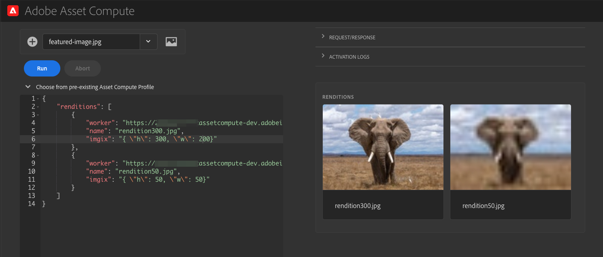

## Test the worker

Just run the following command.

```
$> aio app run
```

After a couple of seconds, it will open Asset Compute Devtool in your browser. Within that tool, you can test your
worker without the AEM.



Since our worker requires `imgix` parameter (as you can see at line 34 in the worker code), you need to provide it in
the worker request object as shown on the screenshot. That parameter must be an escaped JSON. For instance, use the
below parameter to just resize an image to 300x300px.

```json
"imgix": "{ \"h\": 300, \"w\": 300}"
```

Then you run your worker and observe results on the right-hand side of the Asset Compute Devtool.

To let AEM use our worker, deploy the app by running the command.

```
$> aio app deploy
```

As a result of that command, you will get the URL of your worker, similar to the below. Write down that URL as we need
to put it in AEM configuration.

```
Your deployed actions:
  -> MyAssetCompute-0.0.1/__secured_my-worker
  -> https://99999-myassetcompute-dev.adobeioruntime.net/api/v1/web/MyAssetCompute-0.0.1/my-worker
Well done, your app is now online 🏄
```

Next lesson: [Setup AEM to use the worker](lesson5.md)